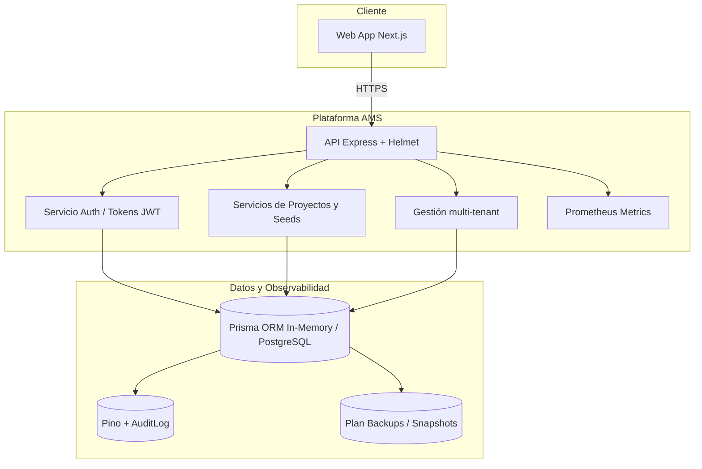

# Sprint 0 — Fundación y Arquitectura

Este documento resume los entregables iniciales habilitados en el repositorio para cubrir los objetivos del Sprint 0 descritos en la propuesta de implementación. La intención es disponer de una base común para los equipos de backend, frontend y operaciones antes de avanzar con los módulos funcionales.

## 1. Arquitectura de referencia

- **Capa de presentación:** el frontend Next.js vive en `apps/web` y consume la API vía HTTPS con cabeceras seguras (`helmet`, CSP, HSTS).
- **Capa de servicios:** Express orquesta rutas autenticadas (`/api/auth`, `/api/users`, `/api/projects`) y añade el nuevo módulo multi-tenant (`tenant`, `tenantArea`, `contract`).
- **Capa de datos:** Prisma abstrae la base. En local usamos una implementación en memoria (`src/lib/prisma.ts`) con semillas representativas; en despliegues se conecta a PostgreSQL manteniendo la misma forma de acceso.
- **Observabilidad:** Pino captura trazas con contexto de request; `/metrics` entrega conteos listos para Prometheus. El plan de backups se documenta más abajo.

## 2. Repositorio base y estándares

- TypeScript 5, Jest y ESLint están configurados en raíz (`tsconfig.json`, `jest.config.ts`, `eslint.config.cjs`).
- Scripts clave (`lint`, `typecheck`, `test`, `accept`) automatizan la validación de calidad.
- `register-paths.js` permite usar `@/` como alias absoluto en toda la base de código.
- El servidor Express (`src/server.ts`) aplica `helmet`, rate limiting de 300 rpm y cabeceras anti-cache por defecto.

## 3. Modelo de datos fundacional

Los componentes multi-tenant y comerciales se modelan en `src/lib/prisma.ts` mediante las nuevas entidades:

| Entidad | Propósito | Campos relevantes |
| --- | --- | --- |
| `Tenant` | Representa a la consultora o cliente corporativo | `slug` único, industria, estado (`ACTIVE/INACTIVE`). |
| `TenantArea` | Organigramas y jerarquías internas | `parentAreaId` opcional para reflejar jerarquías. |
| `Contract` | Contratos marco y vigencias | Código único, estado (`DRAFT/ACTIVE/SUSPENDED/CLOSED`), valores y moneda. |

El `seed` inicial crea un tenant activo con su área corporativa y un contrato marco, junto con el usuario administrador y la compañía de pruebas.【F:src/lib/prisma.ts†L1-L169】

## 4. Gestión de secretos y ambientes

- Variables sensibles (`ACCESS_TOKEN_SECRET`, `REFRESH_TOKEN_SECRET`, etc.) se centralizan en `.env` (plantilla en `.env.example`).
- Para producción se recomienda almacenar secretos en un servicio gestionado (AWS Secrets Manager, GCP Secret Manager o Azure Key Vault) y inyectarlos mediante variables de entorno.
- `env.ts` valida tipos básicos (números, enteros) y provee valores por defecto para ambientes locales.【F:src/config/env.ts†L1-L15】

## 5. Pipelines y CI/CD

- Los comandos `npm run lint`, `npm run typecheck` y `npm test` conforman el pipeline mínimo de CI. `accept.sh` encadena las tres etapas para integraciones rápidas.
- Las pruebas cubren flujos críticos de negocio (autenticación, proyectos, métricas) y ahora también los cimientos multi-tenant (`tests/unit/tenantFoundation.test.ts`).【F:tests/unit/tenantFoundation.test.ts†L1-L83】
- Para despliegues se recomienda un pipeline de dos etapas: build/test (imágenes Docker) y deploy (promocionando a staging y prod). Las imágenes deben incluir migraciones Prisma ejecutadas en el inicio del release.

## 6. Plan de backups y recuperación

1. **Base de datos PostgreSQL:** habilitar snapshots automáticos diarios con retención mínima de 7 días y restauraciones puntuales (`point-in-time`).
2. **Archivos y evidencias:** almacenar en bucket versionado (S3/GCS/Azure Blob) con políticas de ciclo de vida y replicación entre regiones.
3. **Secretos y configuración:** mantener exportaciones encriptadas y rotación trimestral documentada.
4. **Pruebas de restauración:** ejecutar un ejercicio de recuperación trimestral usando ambientes aislados para validar el procedimiento de DR.

## 7. Próximos pasos

- Definir migraciones Prisma para persistir el modelo fundacional en PostgreSQL.
- Configurar la infraestructura IaC (Terraform/Pulumi) que levante VPC, base de datos y pipelines.
- Completar ADRs específicos por decisiones de seguridad (MFA, gestión de claves) y despliegue.

Con esta base se habilita el desarrollo de los módulos de gobernanza y configuración planificados para el Sprint 1.
